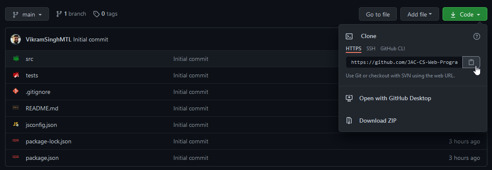

# Exercise 1.2 - Models 💾

- 💯 **Worth**: 2%
- 📅 **Due**: February 7, 2020 @ 23:59
- 🙅🏽‍ **Penalty**: Late submissions lose 10% per day to a maximum of 3 days. Nothing is accepted after 3 days and a grade of 0% will be given.

## 🎯 Objectives

- **Write** models to represent the entities of the application.
- **Verify** code correctness by running the test suite.

## 🔨 Setup

1. Navigate to `~/web-ii/Exercises`.
2. Click `Code -> 📋` to copy the URL to the repository.

   

3. Clone the Git repo `git clone <paste URL from GitHub>` (without the angle brackets).
   - You may have to use the `HTTPS` or `SSH` URL to clone depending on your settings. If one doesn't work, try the other by clicking `Use SSH` or `Use HTTPS` above the 📋, and copy the new URL.
4. You should now have a folder inside `Exercises` called `exercise-1_2-githubusername`.
   - If you want, you can rename this folder `1.2-Models` for consistency's sake! 😉

   ```text
   1.2-Models
   ├── README.md
   ├── jsconfig.json
   ├── package.json
   ├── src
   │   ├── database
   │   │   ├── Database.js
   │   │   └── tables
   │   │       └── pokemon.json
   │   └── models
   │       ├── Model.js
   │       └── Pokemon.js
   └── tests
       └── pokemon.test.js
   ```

      - `package.json`: The configuration file that `npm install` looks for. This file is responsible for keeping track of what _external packages_ our app needs.
      - `Database.js`: A _mock_ database library that mimics using a relational database. You can insert/select/update/delete, and it will persist the data in JSON files.
      - `Pokemon.js`: The model **you'll** be writing code inside. This model represents a single Pokémon and has methods to interact with the database.
      - `pokemon.test.js`: The **test suite** you will be running against your application code. It will call your code from `Pokemon.js`, and will check if your code is doing what it should.
5. Navigate inside the newly-cloned exercise folder and run `npm install` to install all of our dependencies.
   - After running this command, it will generate a `node_modules` folder. If for some reason you have to copy-paste the entire exercise folder in the future, make sure to delete the `node_modules` folder first because it is very large.
   - Note that `node_modules` is declared in the `.gitignore` file for this reason.
6. Check your email (the one that you use for Moodle) and find an email with the subject _You have been added as a student in 420-4W6-AB on Gradescope_.
   - Accept the invitation.
   - Verify that you can see `Exercise 1.2 - Models` in the list along with your submission status and how long you have left to submit.
   - You'll see what to do with this later in the `📥 Submission` section.

## 🔍 Context

To be able to write a full-fledged web application that is well organized, we cannot write code that is haphazardly put together. As much as you may like Italian food, you have to work on not writing [🍝 *spaghetti code*](https://en.wikipedia.org/wiki/Spaghetti_code). To minimize the spaghetti, we will be using the ***MVC Architectural Pattern***:

1. 💾 **Models**
   - represent the real-world *entities* of your app (ex. `Pokemon` or `User`).
   - are responsible for *persisting* data to the database.
2. 🚥 **Controllers**
   - handle incoming *requests*.
   - are responsible for **calling** the right model.
   - render the appropriate **view** to send back in the *response*.
3. 👀 **Views**
   - contain all of the code that the user will **see** and **interact** with.
   - are dynamically constructed based on a **template** and data passed from the **controller**.

In this exercise, you will be writing a **model** to handle the data. The models' classes and methods will have to comply with specific requirements so that they may successfully pass the test suite. The test suite is available for you to use as much as you want while developing the model.

Normally, the *controller* would make the method calls on the *model*. Because we're creating only the *model* by itself, the test suite will act as our stand-in *controller* for now.

## 🧪 Testing

Tests are code that calls our application's code and evaluates if our code is doing what it should be doing. Tests do this via _assertions_, which is a fancy way of saying, "comparing _expected_ vs. _actual_ values". We'll be using [Jest](https://jestjs.io) to test our application's code.

If you run `npm run test` from inside of the exercise's root folder, you should get the following output:

```text
vik@VIK-DESKTOP:~/web-ii/Exercises/1.2-Models$ npm run test

● Pokemon was created successfully.

    expect(received).toBeInstanceOf(expected)

    Expected constructor: Pokemon

    Received value has no prototype
    Received value: undefined

      28 |      const pokemon = await Pokemon.create(name, type);
      29 |
    > 30 |      expect(pokemon).toBeInstanceOf(Pokemon);
         |                      ^
      31 |      expect(pokemon.getId()).toBe(1);
      32 |      expect(pokemon.getName()).toBe(name);
      33 |      expect(pokemon.getType()).toBe(type);

      at Object.<anonymous> (tests/pokemon.test.js:30:18)
```

1. `Pokemon was created successfully` is the name of the test.
2. The rest is the error that occurred when it tried to run the test.
   - This test called the static `create()` method and received a return value that didn't match with what it was expecting. It was expecting a `Pokemon` object, but it actually received `undefined`.
   - The output shows you where exactly the test failed. In this case, it failed inside `tests/pokemon.test.js`, line 30, character 18.
3. It's your job to code the `create()` method, along with the other methods inside of `Pokemon.js`, to get all the tests to pass.

Trust me - you'll feel very satisfied when you see green checkmarks ✅ all the way down!

> 💡 If you go inside of `pokemon.test.js` you will see that the first test has been defined using `test.only(...)`. This makes it so only that one test will run when you do `npm run test`. It is good practice to focus completing one test at a time. **Get one test working, and then move onto the next test.** When you move on to the next test, you can remove `.only` from the previous test, and add it to the next test.

## 🚦 Let's Go

Most of the functions inside `Pokemon.js` have already been declared for you. They will inform you of what each function is expecting as input, and what each function should be returning as output.

> ⚠️ Do not alter any of the function declarations (i.e. function name, input parameters, return type, etc.) that are already present because it will mess up the test suite!

Only add code to the bodies of the functions that are already declared. You will probably also need to write additional functions that the currently-existing functions can call upon.

For each function below, you'll notice that I've provided a `connection` object. You'll need to use this in order to invoke the database operations. I urge you to follow the trail from where this object is being created. Don't just use this object as a [⬛ black box](https://en.wikipedia.org/wiki/Black_box) - dig into the guts and get a solid understand of how it works.

### 🌱 Create

- **Description**: `INSERT` a new row into the database using the input parameters.
- **Type**: `static`
- **Input**:
  - `string name`: Name of the Pokémon (ex. Bulbasaur)
  - `string type`: Type of the Pokémon (ex. Grass)
- **Output**: Return a `Pokemon` object if everything went smoothly. Return `null` if the caller provided invalid data.

### 🔎 Find by ID

- **Description**: `SELECT` a row from the database based on an ID.
- **Type**: `static`
- **Input**:
  - `integer id`: ID of the Pokémon (ex. 1)
- **Output**: Return a `Pokemon` object if everything went smoothly. Return `null` if the caller provided invalid data, or if you could not find a Pokemon by that ID in the database.

### 🔎 Find by Name

- **Description**: `SELECT` a row from the database based on a name.
- **Type**: `static`
- **Input**:
  - `string name`: Name of the Pokémon (ex. Bulbasaur)
- **Output**: Return a `Pokemon` object if everything went smoothly. Return `null` if the caller provided invalid data, or if you could not find a Pokemon by that name in the database.

### 💾 Save

- **Description**: `UPDATE` the corresponding row in the database based on the current state of the member variables.
- **Type**: `instance`
- **Input**: None
- **Output**: Return `true` if the save was successful. Return `false` otherwise.

### 🗑️ Remove

- **Description**: `DELETE` the corresponding row from the database based on the current value of the ID.
- **Type**: `instance`
- **Input**: None
- **Output**: Return `true` if the removal was successful. Return `false` otherwise.

### 📚 Strategies

If you find yourself getting stuck, here are a couple of tips:

1. Snoop inside of `pokemon.test.js` to see how your functions are being called. If you understand the context around a certain function call, you'll know exactly what the test wants.
2. Snoop inside of `Database.js` to see how your database calls are being handled. Remember that this is just a mock database that uses JSON files to persist the data. If you can understand this file, you'll know exactly how to make the function calls from `Pokemon.js`.

Being able to read and understand code that is not yours is an invaluable skill and one that you will be doing a lot on the job! 😉

## 📥 Submission

Check that all tests are passing by removing all occurances of `.only` and running the test suite for the final time. Once you've made your final `git push` to GitHub, here's what you have to do to submit:

1. Go to [Gradescope](https://www.gradescope.ca/courses/828) and click the link for this exercise.
   - If you don't have access, make sure you accepted the invitation sent to your email.
2. In the popup, click _Connect to GitHub_.
3. On the next page, click _Authorize Gradescope_. You may have to log into GitHub if you're not already.
4. Back to the popup, select the correct repository from the dropdown menu.
5. Select the correct branch.
   - If you didn't create multiple branches, then it should be `main`.
6. Click _Upload_.
7. Wait for the autograder to finish grading your submission. Once it's done, you should see the final output of the test results as well as your grade on the top right.
